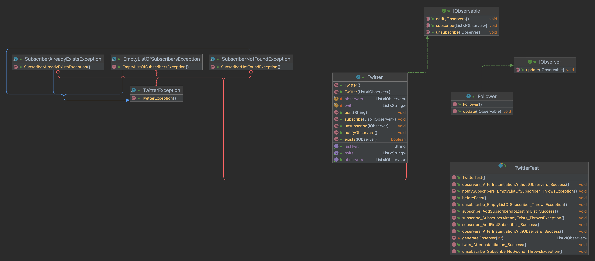

# AMT Labo TDD
> Nicolas Crausaz et Maxime Scharwath

## Introduction

Ce projet a été réalisé pour apprendre à utiliser le TDD (Test Driven Development).
Lien vers le sujet : [Sujet](https://nicolas-glassey.gitbook.io/amt-backlog/2022-2023/roadmap/sem-1-2/labo/git-flow)

Nous avons utilisé le framework JUnit pour réaliser les tests et utilisé la stratégie de développement "Git Flow".

## UML
### Diagramme de classes généré par IntelliJ


## Test
```bash
# Lancer les tests
$ mvn test
```